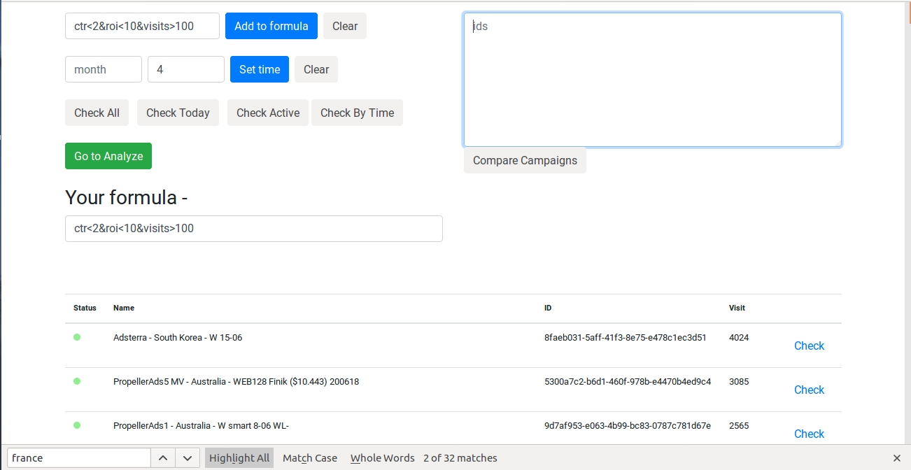
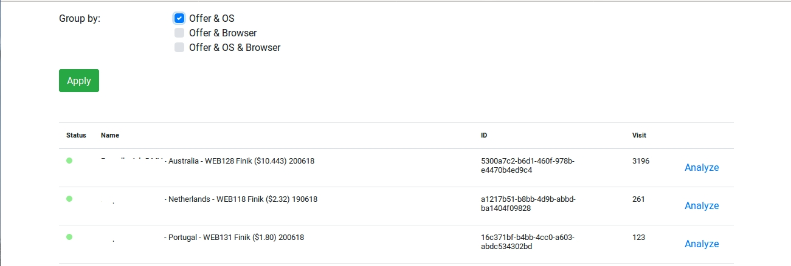
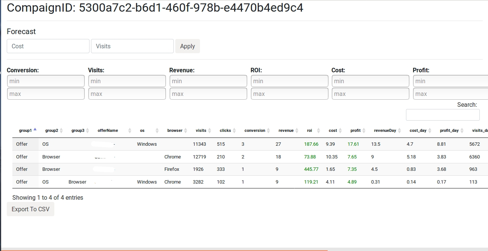

# Voluum_analytics

Analyze your campaigns in voluum and compare ids and settings of platforms/browsers for black lists

<h3>Demo</h3> 

Voluum demo access

http://109.234.38.47:8080/campaign_zones_clear_spring/

api id <b>ad87e504-5f63-4ec8-91dd-04ec35e958a5</b>

api key <b>Zn6T776V4jjZOu3-3zJz2YG4-u-yEGDI-HI0</b>

 

Grouping settings

 

Different filters and forecast your profit

